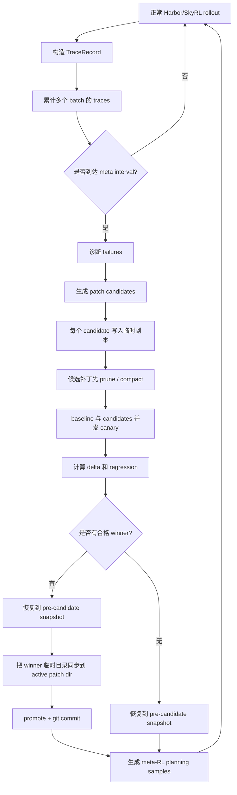

# Codex Memo：SkyRL Harbor Meta Pipeline 当前流程说明

> 状态：基于 2026-04-24 当前代码实现  
> 范围：SkyRL `HarborGenerator` + `skyrl_agent.meta_toolkit` + Harbor `Terminus2` runtime  
> 活跃补丁目录：`/home/ray/SkyRL/examples/train_integrations/harbor/meta_patches/terminus2`  
> 备份状态：`.backup/` 已经被覆写为当前活跃 `37` 个 hook 和 `32` 条策略的精确副本。

---

## 0. 先说结论

现在的 meta pipeline 是一个围绕 Terminal-Bench rollout 的闭环系统：

1. 正常用 SkyRL + Harbor 跑 terminal 任务。
2. 把每条轨迹整理成 `TraceRecord`。
3. 每隔若干 batch 触发一次 meta cycle。
4. meta cycle 先诊断失败原因。
5. 再生成若干个候选补丁 candidate。
6. 每个 candidate 都在临时目录里合并当前补丁、应用新补丁、先 prune/compact。
7. 用 canary 比较当前 active baseline 和 candidate。
8. 只选择 canary 结果最好的一个合格 candidate 合并到 active 补丁目录。
9. 把 planning LLM 的输出和 canary delta 变成 meta-RL 训练样本。

当前最关键的变化是：

> **不是所有正收益 candidate 都合并，而是每轮只提升一个最好的 candidate。**

这个设计是为了控制补丁数量、降低负迁移，并且避免之前那种“很多看起来有用的 hook/策略一起进入系统后整体变差”的问题。

---

## 1. 一张图看完整流程



这张图里最重要的顺序是：

```text
plan candidate -> 临时目录应用 -> prune/compact -> canary -> 只 promote 最优 winner
```

也就是说，canary 评估的是一个已经压缩过的完整补丁库状态，而不是一个临时膨胀的补丁集合。

---

## 2. 代码地图

| 模块 | 文件 | 作用 |
|---|---|---|
| 训练 generator / meta 主控 | `examples/train_integrations/harbor/harbor_generator.py` | 跑 Harbor trials、收集 traces、触发 meta cycle、canary、promote、stage meta samples |
| LLM 诊断 | `skyrl-agent/skyrl_agent/meta_toolkit/diagnosis/interactive_diagnoser.py` | 多 worker 诊断失败任务，生成 `DiagnosisResult` |
| 规则诊断 fallback | `skyrl-agent/skyrl_agent/meta_toolkit/diagnosis/rule_based_diagnoser.py` | 不用 LLM 时根据 failure tags 和统计规则诊断 |
| LLM 补丁规划 | `skyrl-agent/skyrl_agent/meta_toolkit/editing/llm_patch_planner.py` | 生成策略编辑和 hook 代码 |
| 补丁落盘 | `skyrl-agent/skyrl_agent/meta_toolkit/editing/patch_executor.py` | 把 candidate 写进 `strategy_library.yaml` 和 `hooks/*.py` |
| prune / compact | `skyrl-agent/skyrl_agent/meta_toolkit/editing/patch_pruner.py` | 在 canary 前限制策略和 hook 数量 |
| Canary | `skyrl-agent/skyrl_agent/meta_toolkit/validation/canary_runner.py` | 跑 baseline 和 candidate trials |
| 分数比较 | `skyrl-agent/skyrl_agent/meta_toolkit/validation/comparison.py` | 计算 delta、regression、per-task drop |
| Promote | `skyrl-agent/skyrl_agent/meta_toolkit/runtime/promoter.py` | 判断接受/拒绝，写 accepted record |
| 补丁版本控制 | `skyrl-agent/skyrl_agent/meta_toolkit/runtime/patch_version_control.py` | 在 patch 目录内部做 git snapshot/restore/commit |
| Hook 执行器 | `skyrl-agent/skyrl_agent/meta_toolkit/hooks/hook_executor.py` | 加载、验证、smoke test、运行 hooks |
| HookContext | `skyrl-agent/skyrl_agent/meta_toolkit/hooks/hook_context.py` | 定义 hook 能看到和能写的上下文 |
| Terminus2 runtime | `/home/ray/dependencies/harbor/src/harbor/agents/terminus_2/terminus_2.py` | 实际注入 strategies，执行安全化后的 hooks |

---

## 3. 当前补丁目录结构

活跃补丁目录是：

```text
/home/ray/SkyRL/examples/train_integrations/harbor/meta_patches/terminus2/
├── strategy_library.yaml
├── hooks/
├── .backup/
├── .git/
└── case_study/
```

当前状态：

| 类型 | active 数量 | `.backup` 数量 | 状态 |
|---|---:|---:|---|
| 策略 | 32 | 32 | `.backup/strategy_library.yaml` 与 active 完全一致 |
| hook | 37 | 37 | `.backup/hooks/*.py` 文件名和内容与 active 完全一致 |

另外，`terminus2/` 本身有一个独立 git repo。这个 git repo 是为了记录被 promote 的补丁历史，不污染 SkyRL 主 repo。

所以现在有两层恢复手段：

1. `.backup/`：当前这批 37 hooks + 32 strategies 的精确备份。
2. `terminus2/.git`：promote 过的历史补丁版本。

---

## 4. 关键配置默认值

配置类在 `harbor_generator.py` 的 `MetaLoopConfig`。

| 配置 | 默认值 | 含义 |
|---|---:|---|
| `enabled` | `True` | 是否启用 meta loop |
| `interval_batches` | `20` | 每 20 个 generator batch 跑一次 meta cycle |
| `max_candidates` | `2` | 每轮最多生成/评估 2 个 candidate |
| `canary_num_tasks` | `4` | canary 选 4 个任务 |
| `canary_n_samples` | `3` | 每个任务每边跑 3 次 |
| `canary_diagnosed_ratio` | `0.75` | canary 中倾向选择诊断到的失败任务 |
| `canary_min_undiagnosed` | `2` | 至少保留一些未诊断失败任务测泛化 |
| `diagnosis_num_workers` | `16` | LLM 诊断 worker 数量 |
| `diagnosis_partial_tasks` | `8` | 采样 pass/fail 混合的任务数 |
| `diagnosis_all_fail_tasks` | `8` | 采样全部失败的任务数 |
| `diagnosis_all_pass_tasks` | `0` | 采样全部成功的任务数 |
| `max_strategies` | `32` | prune 后策略库最多 32 条 |
| `max_hooks_per_category` | `8` | 每个 hook point 最多 8 个 hook |

如果 `llm_model` 为空，就走 rule-based 诊断和规划；如果配置了 `llm_model`，就走 LLM 诊断与 LLM patch planner。

---

## 5. Stage A：正常 rollout 与 TraceRecord 收集

主入口是：

```python
HarborGenerator.generate(...)
```

每个 batch 进来后：

1. SkyRL 给一组 prompts 和 trajectory IDs。
2. `HarborGenerator` 并发启动 Harbor trials。
3. 每个 trial 用 Terminus2 在 terminal 环境里执行任务。
4. verifier 返回 reward。
5. `harbor_generator.py` 把 trial 结果整理成 `TraceRecord`。

`TraceRecord` 是 meta-learning 的基础数据，里面会有：

| 信息类型 | 例子 |
|---|---|
| 任务身份 | `task_id`、原始 task path |
| 最终结果 | `success`、`final_reward`、`finish_reason` |
| 行为统计 | turn 数、tool call 数、tool failure 数 |
| 失败标签 | timeout、context length、verification failure、planning failure 等 |
| 运行特征 | sync bottleneck score、summarization count 等 |

收集完以后：

```python
self._meta_loop.record_traces(trace_records)
```

这些 traces 会先在内存里累计，直到达到 `interval_batches` 才进入 meta cycle。

---

## 6. Stage B：触发 Meta Cycle

核心函数是：

```python
_MetaLoopController.maybe_run_cycle(run_name)
```

它每个 batch 被调用一次，但只有满足条件时才真正执行：

```text
batch_counter % interval_batches == 0
```

一轮 meta cycle 的顺序是：

1. 把累计 traces 写到 log 目录。
2. 清空当前 trace buffer。
3. 诊断失败原因。
4. 生成 patch candidates。
5. 准备 canary task set。
6. 为每个 candidate 创建临时 patch 目录。
7. 在临时目录中 apply candidate。
8. 在临时目录中 prune/compact。
9. baseline 和 candidates 并发跑 canary。
10. 用 delta/regression 判断 candidate。
11. 只 promote 最好的合格 candidate。
12. 记录 cycle summary。
13. 生成 meta-RL planning samples。

每次训练启动时会创建一个独立 log 目录：

```text
/tmp/skyrl-logs/meta_run_YYYYMMDD_HHMMSS/
```

整理后的常用日志文件：

| 文件 | 内容 |
|---|---|
| `cycle_summary.md` | 人类可读的每轮总结，适合快速看本轮诊断、candidate、canary 和 promote 结果 |
| `events.jsonl` | 所有机器可读事件；用 `stream` 字段区分 diagnosis/planner/canary/pruner 等来源 |
| `llm_conversations.jsonl` | 所有 LLM 诊断和 planning 对话；用 `role` 字段区分 `diagnosis` / `planning` |
| `accepted_patches/*.json` | 被接受补丁的审计记录 |

---

## 7. Stage C：诊断 Diagnosis

诊断阶段的输出统一是 `DiagnosisResult`：

```python
DiagnosisResult(
    problem_type=...,
    root_cause_hypotheses=[...],
    candidate_modules=[...],
    confidence=...,
    affected_task_ids=[...],
    strategy_suggestions=[...],
    metadata={...},
)
```

### 7.1 LLM 诊断模式

使用类：

```text
InteractiveDiagnoser
```

它会把 traces 按 task 分组，然后采样三类任务：

| 类别 | 含义 | 默认数量 |
|---|---|---:|
| `partial` | 同一个任务有成功也有失败 | 8 |
| `all_fail` | 同一个任务所有 rollout 都失败 | 8 |
| `all_pass` | 同一个任务所有 rollout 都成功 | 0 |

每个采样任务会分配给一个 LLM worker。worker 可以用诊断工具查看 trace、比较成功和失败轨迹，并提交 diagnosis。

`partial` 任务尤其重要，因为它可以对比：

```text
同一个任务里，成功轨迹做对了什么，失败轨迹缺了什么
```

这种对比可以提取出 `strategy_suggestions`，后续 strategy planner 会被要求把这些建议加入策略库。

当前诊断 prompt 里允许的 patchable modules 是：

```text
strategy_library
hook:before_llm_call
hook:after_execute
hook:on_timeout
hook:after_round
```

注意：`hook:before_execute` 已经从诊断 prompt 和 registry 中移除。

### 7.2 Rule-based 诊断模式

如果没有配置 `llm_model`，或者 LLM planner 失败 fallback，就走规则诊断：

```text
RuleBasedDiagnoser
```

它根据 batch 统计和 failure tags 生成诊断。

| 问题类型 | 候选模块 |
|---|---|
| `timeout` | `hook:on_timeout`, `strategy_library` |
| `verification_failure` | `hook:after_round`, `strategy_library` |
| `termination_failure` | `hook:after_round`, `strategy_library` |
| `planning_failure` | `hook:before_llm_call`, `strategy_library` |
| `context_overload` | `hook:after_execute`, `hook:after_round`, `strategy_library` |
| `sync_bottleneck` | `strategy_library` |
| `tool_exhaustion` | `hook:before_llm_call`, `strategy_library` |
| `low_reward` | `hook:after_round`, `hook:before_llm_call`, `strategy_library` |
| `general` | `strategy_library` |

---

## 8. Stage D：补丁规划 Patch Planning

LLM patch planner 的核心类是：

```text
LLMPatchPlanner
```

它不是只让一个 LLM 一次性生成所有补丁，而是把每个 candidate 拆成几个 sub-agent。

每个 candidate 默认有三类 sub-agent：

| 子任务 | 允许输出 | 目的 |
|---|---|---|
| `candidate_i/strategy` | 只输出 `strategy_edits` | 修改策略库 |
| `candidate_i/hookgrp_pre_action_controls` | `before_llm_call`, `on_timeout` | prompt guidance 和 timeout recovery |
| `candidate_i/hookgrp_post_action_controls` | `after_execute`, `after_round` | observation signals 和 round-level control |

如果 `max_candidates=2`，每轮 planning 至少会有最多 6 个主要 LLM planning calls，不包括 repair calls。

### 8.1 Strategy planning

策略补丁最终写到：

```text
strategy_library.yaml
```

planner 输出格式类似：

```json
{
  "strategy_edits": [
    {"action": "add", "strategy": {"pattern": "...", "steps": ["..."]}},
    {"action": "edit", "index": 0, "strategy": {"pattern": "...", "steps": ["..."]}},
    {"action": "remove", "index": 2}
  ],
  "rationale": "..."
}
```

`PatchExecutor` 应用顺序是：

1. 先按 index 倒序 remove。
2. 再 edit。
3. 最后 add。

新增策略有一个简单去重规则：

```text
如果已有策略的 pattern 小写后完全相同，则跳过新增。
```

### 8.2 Hook planning

hook 补丁最终写成：

```text
hooks/*.py
```

当前允许生成的 hook point：

| Hook point | 现在的用途 |
|---|---|
| `before_llm_call` | 在 LLM call 前追加短提示 |
| `after_execute` | 观察 terminal output，更新 `context.kv` |
| `on_timeout` | 观察 timeout，更新 `context.kv`，但不能改 terminal output |
| `after_round` | 回合结束后追加 prompt guidance，或在具体错误下请求新一轮 |

当前禁止生成：

```text
before_execute
```

禁用是多层的：

1. planner prompt 要求不要生成。
2. hook repair 阶段会丢弃。
3. pruner 会删除。
4. Terminus2 runtime 不调用 learned `before_execute` hook。

原因是 `before_execute` 可以改命令，风险太大。之前已经出现过会包一层 `su - user -c`、硬改 `/home/user` 路径、截断命令等高危补丁。

### 8.3 Hook validation 与 repair

hook 在成为 candidate 文件前会经过：

```text
_validate_hook_source
_compile_hook
_smoke_test_hook
```

检查内容：

| 检查 | 作用 |
|---|---|
| 必须有且只有一个 `hook` 函数 | 避免模块歧义 |
| import 白名单 | 只允许 `re`, `json`, `math`, `collections`, `itertools`, `functools`, `copy`, `textwrap`, `string` |
| 未定义变量检查 | 捕获常见坏代码 |
| Python compile | 语法和编译检查 |
| smoke test | 用 mock input 调一次 |

如果失败，planner 会尝试让 LLM 修复，最多 3 次。修不好就丢弃。

---

## 9. Stage E：Candidate 临时目录准备

candidate 不会直接写进 active 补丁目录。

每个 candidate 会这样准备：

1. 创建临时目录，例如 `/tmp/meta_canary_candidate_N_*`。
2. 把当前 active `terminus2/` 拷贝进去，排除 `.git`。
3. 把 candidate 文件路径从真实 active 路径 remap 到临时目录。
4. 用 `PatchExecutor` 在临时目录 apply candidate。
5. 在临时目录 run pruner。
6. 从临时目录加载完整 override dict，供 canary 使用。

这样做的效果是：

```text
每个 candidate 被评估时，都是 “当前 active patch library + candidate edits + prune 后” 的完整状态。
```

在所有 candidate 准备前，controller 会先做 snapshot：

```python
pre_all_sha = self._vc.snapshot(label="pre-all-candidates")
```

如果 candidate 没有 winner，或者中间出错，就能恢复到这个 snapshot。

---

## 10. Stage F：Canary 前 Prune / Compact

当前 prune 的位置非常重要：

> **Prune 发生在 canary 前，而且是在每个 candidate 的临时目录中执行。**

类：

```text
PatchPruner
```

这样 canary 测到的就是最终可能 promote 的那个精简补丁库，而不是一个超预算临时库。

### 10.1 策略 prune

预算：

```text
max_strategies = 32
```

如果合并后的策略库超过 32 条，就让 LLM pruner 从所有策略里选 exactly 32 条保留。

pruner prompt 要求：

1. 聚类语义重复策略。
2. 每个重复簇保留最好的代表。
3. 删除 JSON parse error 类策略。
4. 删除过于任务特定、却想全局生效的策略。
5. 偏好文件创建、shell scripting、verification workflow、heredoc 等通用 terminal 任务能力。

### 10.2 Hook prune

允许 hook points：

```text
before_llm_call
after_execute
on_timeout
after_round
```

预算：

```text
max_hooks_per_category = 8
```

这个预算按 hook point 分别限制，所以理论最大值是：

```text
8 before_llm_call
+ 8 after_execute
+ 8 on_timeout
+ 8 after_round
= 32 hooks
```

当前 active 有 37 个 hook，说明这批 active patch 是历史遗留状态；新 candidate 经过当前 pruner 后会被压到预算内，且 `before_execute` 会被删掉。

hook prune 的规则包括：

1. 直接删除 `before_execute`。
2. 删除 trivial/no-op hook。
3. 删除缺 import、未定义变量、容易报错的 hook。
4. 删除重复意图的 hook。
5. 删除会伪造或改写 terminal output 的 `after_execute` / `on_timeout`。
6. 删除会替换原始 observation、或为了普通 completion verification 强行开新轮次的 `after_round`。

prune 结果会写入统一事件日志：

```text
events.jsonl
```

记录类型是：

```text
stream=canary, type=pruner_result
```

---

## 11. Stage G：Canary 评估

Canary 的作用是比较：

```text
当前 active patch baseline
vs
candidate patch state
```

类：

```text
CanaryRunner
```

### 11.1 Canary task 怎么选

选择逻辑在：

```text
_extract_canary_task_paths
```

它先根据 accumulated traces 统计每个 task：

1. rewards。
2. failures。
3. successes。
4. 是否被 diagnosis 提到。

然后选：

1. diagnosed failed tasks。
2. undiagnosed failed tasks。
3. 如果有成功任务，保留一个 success task 检测 regression。
4. 如果没凑够，再 backfill。

默认配置：

```text
canary_num_tasks = 4
canary_diagnosed_ratio = 0.75
canary_min_undiagnosed = 2
```

如果有成功任务，通常会留 1 个 regression slot。因此常见形态是：

```text
1 diagnosed failure
+ 2 undiagnosed failures
+ 1 success regression task
```

如果没有成功任务，则四个 slot 都是失败任务，通常更接近：

```text
2 diagnosed failures + 2 undiagnosed failures
```

这个设计是为了避免 candidate 只 overfit 当前诊断过的失败任务。

### 11.2 Baseline 和 candidate 怎么跑

baseline 使用当前 active overrides：

```python
baseline_overrides = deepcopy(_ACTIVE_META_OVERRIDES) or None
```

每个 candidate 使用自己的临时目录 overrides。

controller 会并发启动：

```text
baseline + all candidates
```

默认每一边跑：

```text
4 tasks × 3 samples = 12 trials
```

Canary 返回的是每个 task 的平均 reward，而不是每次 sample 的原始 reward。

会计算：

| 指标 | 含义 |
|---|---|
| `avg_reward` | 所有 canary tasks 的平均分 |
| `pass_rate` | task 平均分大于 0 的比例 |
| `task_delta` | candidate task reward - baseline task reward |
| `delta_score` | candidate avg - baseline avg |

### 11.3 Regression 判断

比较逻辑在：

```text
ComparisonEngine
```

默认规则：

| 参数 | 默认值 | 含义 |
|---|---:|---|
| `regression_threshold` | `-0.05` | 总体 delta 低于这个值算 regression |
| `max_per_task_drop` | `0.3` | 任一单任务下降超过这个值算 regression |
| `min_canary_tasks` | `1` | 最少需要的 task 数 |

所以 candidate 会被标记 regression，如果：

1. 总体 delta < `-0.05`。
2. 任一 canary task 的平均 reward drop > `0.3`。
3. baseline/candidate score list 为空或无效。

---

## 12. Stage H：Promote 逻辑

当前 promote 不是 “只要正收益就合并”，而是两步：

1. 先用 `Promoter.decide(..., write_record=False)` 判断每个 candidate 是否 eligible。
2. 在 eligible candidates 中选择 `delta_score` 最大的一个。

接受规则：

| 条件 | 结果 |
|---|---|
| canary eval error | reject |
| regression=True | reject |
| delta 低于 reject threshold | reject |
| delta < `min_delta=0.01` | reject |
| delta >= 0.01 且无 regression | accept |

然后只选：

```text
accepted candidates 中 delta_score 最大的 candidate
```

### 12.1 如果存在 winner

流程是：

1. 恢复 active patch dir 到 `pre_all_sha`。
2. 把 winner 的临时目录同步到真实 active `override_base`。
3. 调用 `Promoter.promote(...)`。
4. 写 accepted patch record。
5. 用 `PatchVersionControl` commit 当前 active 补丁状态。
6. 更新 `_ACTIVE_META_OVERRIDES`，后续主 rollout 直接使用新补丁。

### 12.2 如果不存在 winner

流程是：

1. 恢复 active patch dir 到 `pre_all_sha`。
2. 不 promote 任何 candidate。
3. 所有 candidate 记为 rejected。
4. active patch state 不变。

这一步是当前 pipeline 的核心安全阀：

> **每轮最多只让一个经过 canary 验证的 pruned candidate 进入 active。**

---

## 13. Stage I：Meta-RL Training Samples

如果使用 LLM planner，meta loop 会记录 planning LLM conversations。

canary 后，planning conversations 会被转换成：

```python
MetaTrainingSample(
    messages=[...],
    reward=delta_score,
    role="planning",
    instance_id="meta_plan_cycle_N",
    repetition_id=i,
)
```

reward 是对应 candidate 的 canary delta：

```text
candidate 越好 -> reward 越高
candidate 越差/回归 -> reward 越低
```

同一轮 meta cycle 的 planning samples 共享同一个 `instance_id`，不同 candidate 用不同 `repetition_id`。这让它们形成 GRPO 组，可以做组内相对优势训练。

这些 meta samples 不直接 append 到主 rollout batch，因为会破坏 generator output 的 prompts/responses 对齐。当前做法是存在：

```python
self._pending_meta_batch = {
    "prompt_token_ids": ...,
    "response_ids": ...,
    "rewards": ...,
    "loss_masks": ...,
    "stop_reasons": ...,
    "rollout_logprobs": None,
}
```

之后 trainer 可以把它作为单独的 mini training step 消费。

---

## 14. Runtime：策略怎么注入

策略注入发生在 Harbor 的 `Terminus2.run` 里。

当前 active strategy library 会通过 `meta_overrides` 传入 Terminus2，然后调用：

```text
_build_strategy_injection(...)
```

最终 prompt 变成：

```text
<原始任务 instruction>

[LEARNED STRATEGIES]
  When: ...
    1. ...
    2. ...
```

### 14.1 不是全量注入，而是选择性注入

当前 runtime 不会把所有 32 条策略都塞进 prompt，而是分类、打分、限量注入。

限额：

| 类型 | 最多注入 |
|---|---:|
| `core` | 5 |
| `general` | 3 |
| `task_specific` | 2 |
| 总字符数 | 6000 |

scope 判断：

| scope | 判断方式 |
|---|---|
| `core` | 必须显式写 `scope: core` |
| `general` | 默认通用策略 |
| `task_specific` | 如果文本里有具体 `/home/...`、`/tmp/...`、日期、具体文件名，会被推断为任务特定 |

匹配要求：

| 类型 | 注入条件 |
|---|---|
| `core` | 总是 eligible，但仍受数量限制 |
| `general` | 需要和当前任务文本至少有一定关键词匹配 |
| `task_specific` | 必须有更强匹配，通常是具体 artifact/path 匹配 |

这就对应我们前面讨论的目标：

1. 通用策略可以跨任务注入，但限制数量。
2. 任务特定策略只有相关时才注入。
3. 如果没有相关任务特定策略，就不强行注入。

### 14.2 危险策略过滤

runtime 会跳过包含以下片段的策略：

```text
number of files: 5
number of files: 4
su - user -c
exactly these fields: 'analysis', 'plan', 'commands'
```

这些是根据之前有害补丁总结出来的黑名单片段，能挡住一部分明显负迁移策略。

---

## 15. Runtime：Hook 怎么加载和执行

Terminus2 初始化时会处理：

```python
meta_overrides
meta_hooks
```

hooks 通常通过 agent kwargs 传进来，然后：

```python
self._hook_executor = HookExecutor.from_dict(meta_hooks)
self._hook_context = HookContext()
```

`HookContext` 是 hook 能看到的上下文：

| 字段 | 含义 |
|---|---|
| `episode` | 当前 round |
| `total_episodes` | 最大 round 数 |
| `n_commands_executed` | 已执行命令总数 |
| `n_parse_errors` | LLM parse error 次数 |
| `n_timeouts` | timeout 次数 |
| `last_analysis` | 本轮 LLM analysis |
| `last_plan` | 本轮 LLM plan |
| `last_commands` | 本轮命令列表 |
| `is_task_complete` | 本轮是否标记完成 |
| `original_instruction` | 原始任务文本 |
| `last_terminal_output` | 最近 terminal output |
| `execution_history` | 最近 20 轮历史 |
| `last_llm_response` | 原始 LLM response |
| `forced_continue_count` | after_round 强制继续次数 |
| `kv` | hook 可写的持久字典 |

原则上，hook 应该只写 `context.kv`。它拿不到完整 agent internals。

不过要注意：

> 现在这是工程隔离，不是强安全沙箱。

目前的安全主要来自：

1. 静态校验。
2. compile 和 smoke test。
3. runtime try/except。
4. 禁用命令改写。
5. 限制 prompt/output 影响。
6. canary 后才 promote。

---

## 16. 多 hook 的执行语义

同一个 hook point 可以有多个 hook。

普通 pipeline hook 顺序执行：

```text
before_llm_call
after_execute
on_timeout
on_parse_error
```

即前一个 hook 的返回值作为后一个 hook 的输入。

`after_round` 比较特殊：多个 after_round hook 会独立收到相同原始输入，然后 merge 结果。

merge 规则：

| 字段 | 合并方式 |
|---|---|
| `inject` | 多个文本拼接 |
| `next_prompt` append | 多个 append prompt 拼接 |
| `next_prompt` replace | runtime 忽略 replace，只按 append 处理，不能覆盖原始 observation |
| `request_new_turn` | 只要一个 hook 请求就是 True |

`context.kv` 隔离规则：

1. 如果同一点只有一个 hook，就用普通共享 context。
2. 如果同一点有多个 hook，会按 generation group 隔离 `kv`。
3. 同一个 planner sub-agent 生成的一组 hook 可以共享一个 `kv` namespace。
4. 不同组之间不会互相污染。

---

## 17. Runtime hook 具体权限和限制

### 17.1 `before_llm_call`

执行位置：

```text
每次 LLM call 前
```

当前限制：

```text
append-only
```

runtime 只接受以原始 prompt 为前缀的返回值。如果 hook 尝试重写整个 prompt，会被忽略。

追加长度上限：

```text
1200 chars
```

适合：

```text
轻量提醒、循环检测后的短建议、任务聚焦提示
```

不适合：

```text
重写任务、覆盖 parser feedback、注入大段策略库
```

### 17.2 `before_execute`

当前已禁用。

agent loop 里只保留注释，不执行 learned `before_execute` hooks。

原因：

```text
它能修改、删除、包装 shell commands，blast radius 太大。
```

之前有害例子包括：

1. 把命令包成 `su - user -c`。
2. 硬编码 `/home/user` 路径改写。
3. 截断或重排命令。
4. 改变用户真实想执行的 shell 行为。

### 17.3 `after_execute`

执行位置：

```text
命令成功执行后
```

当前限制：

```text
observation-only
```

hook 可以更新 `context.kv`，但返回的 terminal output mutation 会被 runtime 忽略。

适合：

```text
记录输出长度、检测 error marker、记录是否出现大输出、给 after_round 提供信号
```

不适合：

```text
伪造 terminal output、删掉错误信息、把输出改成看起来成功
```

### 17.4 `on_timeout`

执行位置：

```text
命令 timeout 后
```

签名：

```python
hook(command_keystrokes, terminal_output, context)
```

返回 string 仍需保持原始 `terminal_output` 不变；runtime 会忽略 timeout hook 对 terminal output 的改写。这个 hook 的主要价值是记录 timeout 相关状态，例如写入 `context.kv["last_timeout_command"]`，供后续 `after_round` 或 `before_llm_call` 生成提示词使用。

适合：

```text
告诉模型命令超时、建议换更小范围命令、建议检查进程/文件/日志
```

### 17.5 `after_round`

执行位置：

```text
每轮结束后，completion 逻辑最终确定前
```

返回格式：

```python
{
    "inject": "...",
    "request_new_turn": True,
    "next_prompt": "...",
    "prompt_mode": "append"  # replace 会被 runtime 当作 append 处理
}
```

长度限制：

| 字段 | 上限 |
|---|---:|
| `inject` | 1200 chars |
| `next_prompt` | 1200 chars |

`inject` 和 `next_prompt` 都只会作为 prompt guidance 追加在原始 observation 后面，不会改写 `terminal_output` 本身，也不能替换原始 observation。

`request_new_turn` 的当前规则：

1. 如果 agent 还没声明 `task_complete`，允许请求新一轮。
2. 如果 agent 已经声明 `task_complete`，只有检测到具体 hard error 才允许强制新一轮。
3. 即使允许，confirmed completion 后强制继续最多 1 次。

hard error markers 包括：

```text
command not found
permission denied
no such file or directory
traceback
syntax error
cannot
failed
not a directory
is a directory
```

这个设计保留了 `after_round` 的价值，但限制了它制造无限 verification loop 的能力。

---

## 18. 当前安全设计总结

| 风险 | 当前防护 |
|---|---|
| 策略太多导致 prompt 污染 | runtime 只选择少量匹配策略，pruner 限制总数 32 |
| hook 太多导致行为不可控 | pruner 每个 hook point 限制 8 个 |
| hook 代码质量差 | validate、compile、smoke test、repair，失败则丢弃 |
| 命令被篡改 | `before_execute` 从 planner/registry/pruner/runtime 移除 |
| terminal output 被伪造 | `after_execute` / `on_timeout` 返回值 mutation 被忽略 |
| prompt 被重写 | `before_llm_call` 只能 append |
| 原始 observation 被替换 | `after_round` 的 `prompt_mode=replace` 会被当成 append，不能覆盖原始输出 |
| completion verification 死循环 | `after_round` 新轮次请求被 hard-error gate 和 forced cap 限制 |
| candidate 过量累积 | 每轮只 promote 一个最优 winner |
| active patch 被中间 candidate 污染 | candidate 在临时目录评估，active 有 git snapshot/restore |
| task-specific 策略负迁移 | runtime 要求任务匹配才注入 |

---

## 19. 当前 pipeline 想优化什么

当前设计不是追求“meta 模型生成尽可能多补丁”，而是追求 Terminal-Bench 分数稳步提升。

它偏好：

1. 小而通用的策略改进。
2. 只在相关任务上注入任务特定策略。
3. hook 主要观察和轻量引导，而不是接管执行。
4. 每个 candidate 都先经过 compact，再被 canary 评估。
5. 每轮最多合并一个 winner。
6. canary 中保留一些未诊断任务，减少 overfit。

它刻意避免：

1. 全量注入所有策略。
2. 命令改写 hook。
3. 大段 prompt rewrite。
4. terminal output fabrication。
5. 正收益 candidate 全部合并。
6. 把任务特定记忆当成全局知识。

---

## 20. 仍然需要注意的弱点

### 20.1 `core` 策略机制存在，但 planner 还不一定会主动生成

runtime 已经支持：

```yaml
scope: core
```

但当前 planner 输出通常只是：

```yaml
pattern: ...
steps: ...
```

如果未来希望稳定形成少量全局核心策略，需要让 planner 显式学会给策略标注 `scope`、`priority`、`triggers`、`anti_triggers`。

### 20.2 Hook 隔离不是强安全沙箱

Hook 当前是 API 层面的隔离和校验，不是完整 OS sandbox。

目前风险可控主要是因为：

1. 禁用了 `before_execute`。
2. 忽略 `after_execute` 输出 mutation。
3. 限制 prompt append 长度。
4. catch hook exception。
5. canary 后才 promote。

如果后续恢复更强 hook 权限，需要重新设计 sandbox。

### 20.3 Canary 很小，有噪声

默认 canary 是：

```text
4 tasks × 3 samples
```

优点是快，缺点是噪声大、覆盖有限。

当前缓解方式：

1. 同时放 diagnosed 和 undiagnosed failure。
2. 有成功任务时留一个 regression task。
3. 使用 per-task drop guard。
4. 每轮只 promote 一个 winner。

### 20.4 Pruner 质量依赖 meta LLM

当策略或 hook 超预算时，LLM pruner 要选择保留哪些。如果 meta LLM 能力弱，它可能保留浅层、重复甚至有害的补丁。

runtime selector 和危险片段过滤能挡一部分，但不能完全替代高质量 pruner。

### 20.5 当前 active hook 数量还是历史遗留偏多

active 现在有 37 个 hook，而当前新 pipeline 的预算理论上会控制到每个 hook point 8 个以内。

这说明 active 目录里还有历史产物。新的 candidate 会经过 prune，但如果想让当前 active 立刻符合新规则，需要专门跑一次 active-level prune 或人工清理。

---

## 21. 和之前方案相比，现在已经改掉了什么

| 旧问题 | 当前变化 |
|---|---|
| 策略全量注入 | 改成 core/general/task_specific 选择性注入 |
| 任务特定策略污染全局 | task_specific 必须和任务强匹配才注入 |
| candidate 只要正收益就合并 | 改成只 promote 最好的一个 winner |
| prune 放在 promote 后可能不一致 | 改成 candidate 临时目录里先 prune 再 canary |
| before_execute hook 高风险 | 从生成、诊断、prune、runtime 中禁用 |
| after_execute 伪造输出 | runtime 忽略输出 mutation，只允许观察副作用 |
| after_round 容易无限验证 | hard-error gate + forced continue cap |
| active 状态容易污染 | temp dir + git snapshot/restore |

---

## 22. 当前最值得继续优化的方向

如果目标是继续提高 Terminal-Bench 2 分数，同时保持 pipeline 简洁，我认为后续最值得做的是：

### 22.1 给策略增加结构化 metadata

建议让 planner 生成：

```yaml
scope: core | general | task_specific
priority: 0.0-1.0
triggers:
  - ...
anti_triggers:
  - ...
```

好处：

1. runtime 不用只靠文本正则推断 scope。
2. core/general/task_specific 更稳定。
3. 任务相关性选择更准。
4. pruner 更容易判断哪些该保留。

### 22.2 把 hook 产物默认降权

如果 strategy 和 hook 同时可用，优先生成 strategy。

hook 适合处理：

1. timeout recovery。
2. loop/stuck detection。
3. hard error 后请求新轮次。
4. 输出统计信号。

不适合处理：

1. 具体任务答案。
2. 文件路径改写。
3. 命令修复。
4. completion 常规验证。

### 22.3 active patch 定期 compact

现在 candidate 会 compact，但 active 历史补丁可能已经偏多。

可以增加一个低频 active compaction cycle：

```text
每 N 个 meta cycles：
  active -> temp copy -> prune -> canary against active
  如果不降分，再替换 active
```

这样可以减少历史垃圾补丁的长期影响。

### 22.4 Canary 任务选择可以加一个固定 anchor set

当前 canary 主要来自最近 traces。可以额外加少量固定 anchor tasks：

```text
1 个文件创建 anchor
1 个 shell/awk/sed anchor
1 个 archive/checksum anchor
1 个 service/database anchor
```

这样可以更稳定检测通用能力回归。

---

## 23. 术语表

| 术语 | 含义 |
|---|---|
| active patch dir | 当前 Terminus2 runtime 会读取的补丁目录 |
| strategy | YAML 里的 prompt-level 策略，包含 `pattern` 和 `steps` |
| hook | 注入 Terminus2 loop 的 Python 函数 |
| candidate | planner 生成的一组候选补丁 |
| temp candidate dir | candidate 应用和 canary 前 prune 的临时补丁目录 |
| canary | 小规模 baseline vs candidate A/B 测试 |
| promote | 把最优 candidate 同步到 active patch dir |
| meta-RL sample | 用 canary delta 奖励的 planning LLM 对话样本 |
| regression guard | 如果总体或单任务分数下降太多，就拒绝 candidate |
| negative transfer | 补丁在某些任务有用，但注入到不相关任务后反而降分 |

---

## 24. 一句话总结

当前 meta pipeline 是：SkyRL 正常跑 terminal 任务并收集 traces，meta 模型根据失败诊断生成少量策略/hook 候选补丁，每个候选补丁先在临时目录合并并 prune，再与当前 active baseline 做 canary 对比，最终只 promote 最好的非回归 winner，同时把 planning 输出按 canary delta 变成 meta-RL 训练信号。
